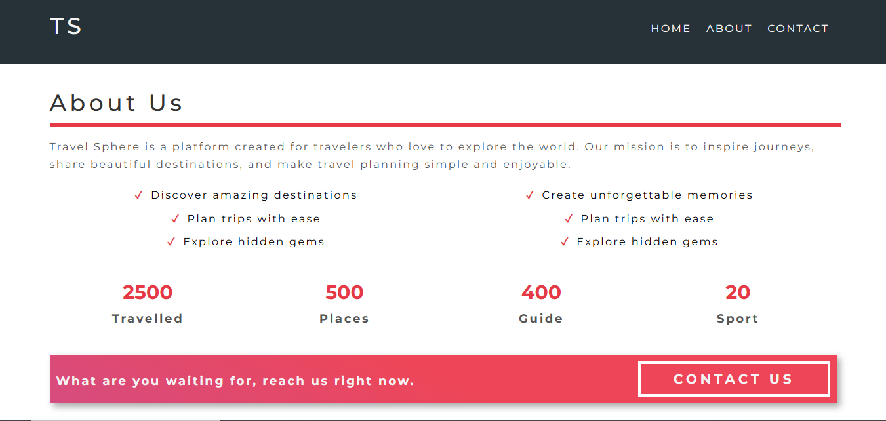
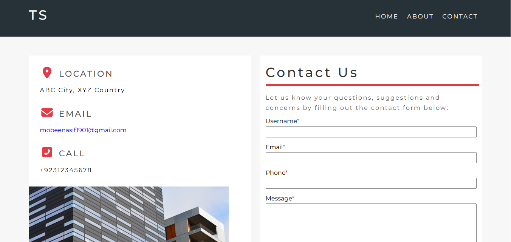
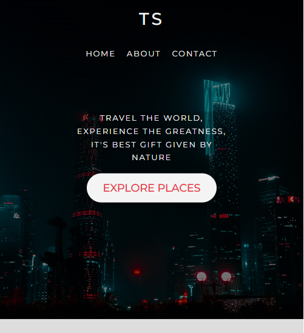

# 🌍 Travel Sphere

Travel Sphere is a modern, responsive travel website built using **HTML and CSS**.  
The project focuses on clean UI design, responsive layouts, and visual presentation for a travel-themed website.

---

## 🚀 Live Demo

🔗 https://traavel-sphere.netlify.app/

---

## 📌 Project Overview

Travel Sphere is a front-end portfolio project created to demonstrate website layout, responsive design, and styling using core web technologies. It is designed as a static website and does not use JavaScript.

---

## ✨ Features

- Fully responsive design (desktop, tablet, mobile)
- Clean and modern travel-inspired UI
- Simple and readable code structure
- Fast and lightweight static website
- Deployed using Netlify

---

## 🛠 Tech Stack

- **HTML5** – Structure and content  
- **CSS3** – Styling and responsiveness  

---

## 📸 Screenshots

Homepage  

About 

Contact 

Mobile View 

## ⚙️ Installation & Setup

### Clone the repository

git clone https://github.com/your-username/travel-sphere.git

### Open the project folder

cd travel-sphere

### Open index.html in your browser
(No additional setup required)

---

## 🎯 Purpose & Learning Goals

- Practice HTML and CSS fundamentals
- Improve responsive web design skills
- Build a portfolio-ready static website
- Learn website deployment using Netlify

## 🔮 Future Improvements

- Add JavaScript for interactivity
- Include animations and transitions
- Add contact or inquiry form
- Improve accessibility
- Convert into a dynamic travel platform

## 👤 Author

Created and designed by **Mobeen Asif**.

## 📄 License

This project is licensed under the MIT License.
